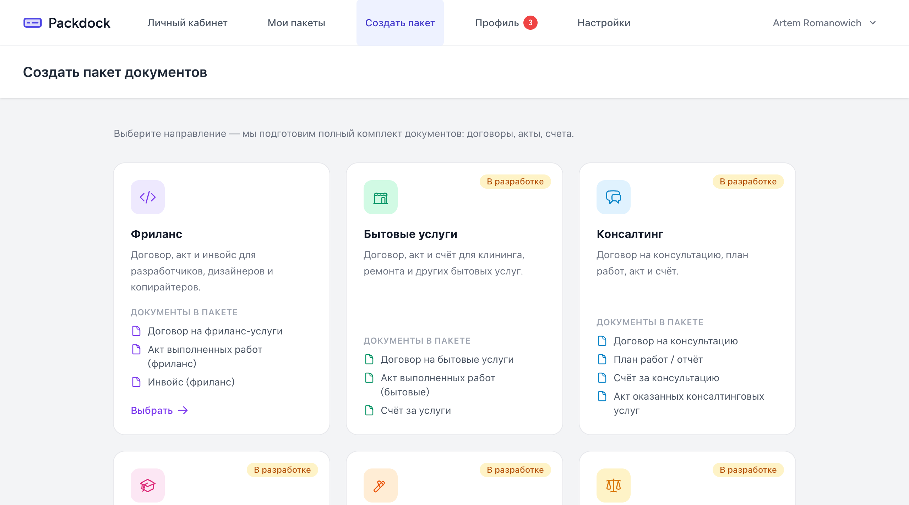

# Packdock

[](https://laravel.com/)
[](https://vuejs.org/)
[](https://inertiajs.com/)
[](https://vite.dev/)
[](https://github.com/barryvdh/laravel-dompdf)
[](https://phpunit.de/)

> [Русская версия](README.md)

A web service for quickly producing legal and business document packages: contracts, acts, invoices and bills. The user picks a direction (freelance, household services, consulting, tutoring, construction, legal services), fills in a questionnaire — and gets a ready-to-download PDF bundle.

Monolith on **Laravel 13** + **Vue 3** via **Inertia.js**. Documents are rendered with **DomPDF** (Blade → HTML → PDF) with Cyrillic support.

<p align="center">
  
</p>

---

## Features

- **Card-based direction picker** — freelance, household services, consulting, tutoring, construction, legal services (some directions are in progress)
- **Package questionnaire** — structured input split into sections: contract, contractor, client, service, payment, meta (act number, acceptance days, penalty terms)
- **Profile pre-fill** — contractor details (full name, company, tax ID, phone, default currency) are pulled from the user profile
- **Bundle generation** — the freelance package contains a contract, an act of work performed and an invoice
- **PDF rendering** — DomPDF on top of Blade templates, A4 format, DejaVu Sans (Cyrillic-friendly)
- **Whole-package preview in one PDF** — `streamCombinedPdf` glues HTML fragments into a single preview
- **Drafts and completed packages** — `draft` / `completed` statuses, resume an unfinished questionnaire any time
- **Duplicate a package** — start a new one from an existing one (status is reset to draft)
- **Download / preview individual documents** — three actions per document: HTML render, inline PDF preview, PDF download
- **Subscription** — `free` / `trial` / `paid` status and a `package_created_count` counter
- **Laravel Breeze auth (Inertia)** — sign-up, sign-in, password reset, email verification

---

## Tech stack

| Layer | Technologies |
|-------|--------------|
| Backend | Laravel 13, Sanctum 4, Inertia Laravel 2, Ziggy 2, Eloquent ORM, SQLite |
| Frontend | Vue 3 (Composition API), Inertia.js Vue 3, Vite 6, Tailwind CSS 3, Axios |
| PDF | barryvdh/laravel-dompdf 3, Blade templates, DejaVu Sans |
| Auth | Laravel Breeze (Inertia stack) |
| Tests | PHPUnit 12 (feature + unit) |
| Tooling | Laravel Pail (logs), Laravel Pint (style), Concurrently (dev runner) |

---

## Architecture

### Package generation workflow

```
User ──► /packages/create ──► Direction picker (cards)
                                       │
                                       ▼
                          /packages/create/{category}
                                       │
                                       ▼
                            Questionnaire.vue
                  — pre-filled from UserProfile
                  — sections: contract / contractor / client / service / payment / meta
                                       │
                  ┌────────────────────┼────────────────────┐
                  ▼                    ▼                    ▼
            POST /packages      POST /preview         POST /draft
            status: completed   stream combined PDF   status: draft
                  │                                          │
                  ▼                                          ▼
            DocumentPackage (data JSON)                 back to /packages
                  │
                  ▼
        /packages/{id}/documents
                  │
        ┌─────────┼──────────┐
        ▼         ▼          ▼
   render HTML  preview PDF  download PDF
                (stream)     (attachment)
                  │
                  ▼
       DomPDF: Blade → HTML → PDF (A4, DejaVu Sans)
```

### Package data storage

`DocumentPackage` keeps questionnaire input in a JSON `data` column — no per-direction tables. Structure:

```
data
├── contract        # number, date, city
├── contractor      # full name, email, phone
├── client          # full name / company, email
├── service         # name, description, start / end dates
├── payment         # price, currency, terms, requisites, due date
└── meta            # act number, invoice number, acceptance days, penalty terms
```

The `type` field (`freelance`, and on the roadmap — `household`, `consulting`, …) decides which Blade templates are rendered: `documents.{$type}.{$document}`. Adding a new direction = one templates folder + one branch in `DocumentPackageController`.

### Subscription

`User.subscription_status` (`free` / `trial` / `paid`) and `User.package_created_count` live on the user model. This is the foundation for free-tier limits and billing.

### Auth

Laravel Breeze in the Inertia flavour: session + CSRF, guest routes (`/`, `/login`, `/register`) and routes protected by the `auth` middleware (`/dashboard`, `/packages`, `/profile`, `/account`).

---

## Project structure

```
packdock/
├── app/
│   ├── Enums/                  # DocumentPackageStatus, DocumentType, EmploymentType, SubscriptionStatus
│   ├── Http/
│   │   ├── Controllers/        # Dashboard, DocumentPackage, Profile, UserProfile, Auth/*
│   │   ├── Middleware/
│   │   └── Requests/
│   ├── Models/                 # User, UserProfile, DocumentPackage, DocumentCategory, DocumentTemplate
│   ├── Providers/
│   └── Services/
│       └── DocumentGeneratorService.php   # DomPDF wrapper (download / stream / combined)
├── resources/
│   ├── js/
│   │   ├── Components/         # Header, Footer, Modal, DocumentPreview, UserProfileForm, …
│   │   ├── Composables/
│   │   ├── Layouts/            # AppLayout, AuthenticatedLayout, GuestLayout
│   │   └── Pages/              # Welcome, Dashboard, Packages, Packages/{Create,Questionnaire,Documents}, Account, Profile, Auth/*
│   └── views/
│       └── documents/
│           ├── freelance/      # contract.blade.php, act.blade.php, invoice.blade.php
│           └── preview-all.blade.php
├── routes/
│   ├── web.php                 # Inertia + auth-protected routes
│   └── auth.php                # Breeze
├── database/
│   ├── migrations/             # users (+ subscription), user_profiles, document_categories/templates, document_packages
│   └── seeders/                # DocumentCategorySeeder, DocumentTemplateSeeder, UserProfileSeeder, DocumentPackageSeeder
└── tests/
    ├── Feature/                # Auth/*, ProfileTest
    └── Unit/
```

---

## Quick start

### Requirements

- PHP >= 8.3
- Node.js >= 20
- Composer
- SQLite (default; switch via `DB_*` in `.env` for another DB)

### Installation

```bash
composer install
cp .env.example .env
php artisan key:generate
touch database/database.sqlite
php artisan migrate --seed

npm install
npm run build       # or npm run dev for dev mode
```

### Run

One command (server + queue + logs + vite):

```bash
composer dev
```

Or separately:

```bash
php artisan serve   # http://localhost:8000
npm run dev         # vite dev server
```

---

## Routes

Protected routes are under the `auth` middleware. Auth flows (`/login`, `/register`, `/forgot-password`, etc.) come from Laravel Breeze via `routes/auth.php`.

| Method | Path | Purpose | Auth |
|--------|------|---------|:----:|
| `GET` | `/` | Welcome | — |
| `GET` | `/dashboard` | User dashboard | + |
| `GET` | `/packages` | List user packages (paginated by 20) | + |
| `GET` | `/packages/create` | Direction picker | + |
| `GET` | `/packages/create/{category}` | Direction questionnaire | + |
| `POST` | `/packages` | Create a package (`status: completed`) | + |
| `POST` | `/packages/preview` | Combined PDF preview of all documents | + |
| `POST` | `/packages/draft` | Save a draft | + |
| `GET` | `/packages/{package}/edit` | Edit a package | + |
| `PUT` | `/packages/{package}` | Update a package | + |
| `POST` | `/packages/{package}/draft` | Move a package back to draft | + |
| `GET` | `/packages/{package}/documents` | Documents in a package | + |
| `GET` | `/packages/{package}/documents/{document}` | HTML render of a document | + |
| `GET` | `/packages/{package}/documents/{document}/preview` | Inline PDF preview | + |
| `GET` | `/packages/{package}/documents/{document}/pdf` | Download PDF | + |
| `POST` | `/packages/{package}/duplicate` | Duplicate a package | + |
| `DELETE` | `/packages/{package}` | Delete a package | + |
| `GET` | `/profile` | Account settings | + |
| `PATCH` | `/profile` | Update account | + |
| `DELETE` | `/profile` | Delete account | + |
| `GET` | `/account` | Contractor profile | + |
| `PUT` | `/user-profile` | Update contractor profile | + |

---

## Tests

```bash
php artisan test
```

Coverage: register / login / logout, password reset, email verification, password update, profile update, account deletion.

---

## Key engineering decisions

| Decision | Why |
|----------|-----|
| **Inertia instead of a separate SPA + REST** | One stack, shared routing, server-driven navigation — no duplicated routing or validation |
| **JSON `data` column on `DocumentPackage`** | Questionnaires differ a lot per direction; normalising each direction is premature complexity |
| **`type`-driven Blade templates (`documents.{type}.{slug}`)** | A new direction is just a new templates folder; the generator service stays untouched |
| **DomPDF + DejaVu Sans** | Cyrillic out of the box, rendering via familiar HTML/CSS, no headless browser required |
| **Preview merging via `<body>` extraction** | Combine several documents into a single PDF without iframe hacks or a separate PDF-merge dependency |
| **Drafts as a status, not a separate table** | The same record goes through its full lifecycle (draft → completed) — simpler migrations and analytics |
| **Laravel Breeze (Inertia)** | Standard auth scaffold for the chosen stack, no custom rolling |

---

## Roadmap

- [ ] «Household services» package (contract + act + bill)
- [ ] «Consulting» package (contract + workplan + act + bill)
- [ ] «Tutoring» package
- [ ] «Construction» package
- [ ] «Legal services» package
- [ ] DOCX export (`DocumentType::Docx` is already reserved)
- [ ] Electronic document signing
- [ ] Billing and free-tier limits
- [ ] Email notifications (send the package to the client)
- [ ] E2E tests for Vue pages

---

## Authors

**Roman Serenko**
